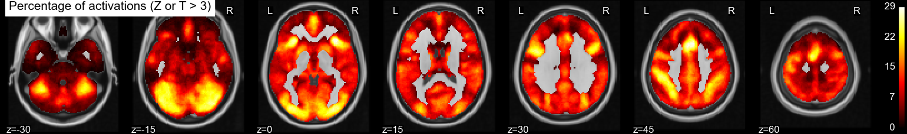
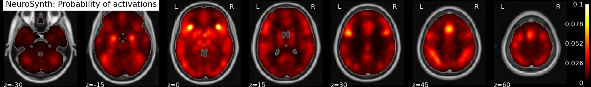
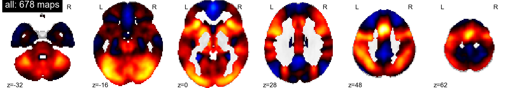
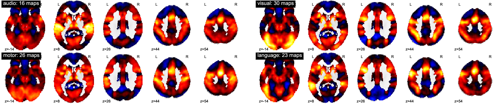
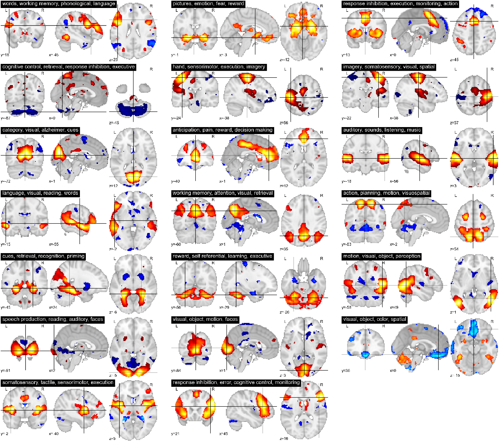

Spatial distribution of activations
------------------------------------

    **Figure 1:** Spatial distribution of activations in NeuroVault

Figure 1 shows the spatial distribution of activation for the maps in
NeuroVault: the of how many times a voxel appeared in a statistical map
with a Z or a T greater than 3. The distribution is strickingly
non-uniform throughout gray matter. In particular, the regions most
represented are the frontal part of the insula and dorsal ACC, that form
a well-known cingula-insulate control network associated with salience
processing [Seeley 2007, Dissociable Intrinsic Connectivity Networks for
Salience Processing and Executive Control]. The other structures
highlighted in figure 1 are the IPS, the , --regions sometimes called the
"task positive network" [Fox 2005, The human brain is intrinsically
organized into dynamic, anticorrelated functional networks]-- as well as
the occipital lobe, encompassing the visual cortex. The presence of the
latter can be explained by the fact that many experiments rely on visual
stimuli. Interestingly, the networks that stand out on this map are
largely related to attention and executive control.

Figure 2 shows a similar map computed from a coordinate-based meta
analysis database, NeuroSynth, that collects coordinates of activation
foci from the literature [Yarkoni ...]. It displays a similar density of
activation, with visible attentional networks. However, the visual cortex
is much less present, possibly because researchers tend to report in
publications coordinates of high-level contrasts that cancel out
low-level effects of stimuli. On the opposite, the NeuroVault database
contains a variety of contrasts, including task-versus-baseline maps.

    **Figure 2:** Spatial distribution of activations in NeuroSynth

Term-average maps
------------------

From a global perspective, to understand better the spatial distribution
of detections, it is also interesting to look at the average activation
across all the database. On figure 3 we give the overall average of the
statistical maps.

    **Figure 3:** Mean map for all the statistical maps in NeuroVault

Unlike a simple count of statistically-significant detections, as in a
coordinnate-based meta-analysis, this analysis also captures the dominant
sign of the activation, accumulating power in regions that may not
cross threshold in individual analyses [#]_. The average maps clearly
shows regions that responds, on average, by a deactivation, rather than
an activation. These span the default-mode network, that was historically
discovered in a similar analysis, noting a decrease in activity across a
variety of tasks [Shulman 1997, Common blood flow changes across
visual tasks: II. Decreases in cerebral cortex].

.. [#] Note that doing a principled statistical inference, eg computing
       an p-value or a posterior from this heterogeneous collection of
       maps require methodological developments outside of the scope of
       this article.

One challenge to run finer analysis on data hosted on neurovault is that,
unlike BrainMap [Fox XXX] or NeuroSynth [Yarkoni XXX], the images do not
come with explicit labels describing their content. We use a simple
heuristic to assign labels to images: for each image, we look at its
meta-data: its name, description, description of the contrast, if
available. We assign a label to an image if this meta-data contains a
term associated with, where the labels and associated terms are given in
table 1.

========== ====================================================================
Label       Associated terms
========== ====================================================================
language    semantic, linguistic, language, word, words, reading, verb, voice
audio       audio, auditory, audition, listening
motor       motor, button, hand
visual      face, imagery, scrambled, checkerboard, color, visual, visually
========== ====================================================================

  **Table 1**: labels and associated terms
 

    **Figure 4:** Mean map for entries of the database containing various
    terms

Figure 4 shows for each label the mean map of all the entries of the
database that contains the corresponding terms. We can see that this very
rough meta-analysis does capture some meaningful information. Indeed, the
average activation related to "auditory" terms highlights very well the
auditory cortex. Similarly the "visual" terms light up the occipital
cortex. However, all these average maps contain non-specific regions that
are not directly related to the terms probed. First, they contain
attentional and executive networks, in particular the dorsal ACC and
frontal insula. Their presence may be explained from the fact that such
functions are recruited in every task performed in the scanner. Second,
they contain regions that are only indirectly linked to the label. The
language terms highlight the visual word-form area [McCandliss, the visual
word form area: expertise for reading in the fusiform gyrus], in the left
fusiform cortex. On the map related to motor terms, the motor cortex
appears washed out, possibly because it not the focus of the
corresponding experiments, but solely appears during the subject's response.

Independant component analysis
-------------------------------

In cognitive neuroimaging, the conventional approach to disentangle
various cognitive effects is to craft specific contrasts, revealing the
effect of interest in the experiment. Accumulation of data via an image
store such as NeuroVault opens the door to additional statistical power,
highlighting new phenomena, such as the default mode network. However, as
seen from the term-based analysis, crafting contrasts across experiments
is challenging without an exact knowledge of not only the cognitive
questions probed by the experiments, but also contingent experiment
details such as how the stimuli were presented or what we the subject's
response. One possible approach to exploit the richness of the database
is to rely on data-driven method to *unmix* different cognitive
components. In figure 4, we show the results of an Independent Component
Analysis (ICA) on the NeuroVault database. We extract 20 co-activation
networks. We use the following strategy to retrieve the cognitive content
that these networks capture. First we use the decoding functionality of
NeuroSynth [Yarkoni XXX] to associate with each statistical map in
Neurovault cognitive loadings: weights for each term in NeuroSynth. The
unmixing matrix estimated by ICA is applied to go from these map-level
loadings to loadings for each network. On figure 4, we represent with
each ICA network alongside with the four terms most heavily loaded.

This analysis is similar to that conducted in [Smith 2011, Correspondence
of the brain's functional architecture during activation and rest] on the
brainmap database, however [Smith 2011] rely on manually labeled and
curated data whereas here we use fully automated extraction of
information.

    **Figure 4:** ICA networks extracted from the NeuroVault database.
    The labels of the networks are automatically computed from the terms
    decoded on the NeuroVault maps. Note that here we report all the
    components, unlike in most ICA analysis.

______

**Concluding remarks**

We have presented a first analysis of a few hundred brain images
accumulated with little-to-none curation across multiple labs and
multiple experiments. Analysis of such heterogeneous data has to overcome
new challenges, such automatically discovering the cognitive content of
the brain maps or teasing out the multiple psychological effects that are
intertwined in the database. Our analysis leads to promising preliminary
results. We have automatically extracted functional networks, with brain
maps and associated cognitive concepts, from a relatively small number of
images (BrainMap and NeuroSynth cover respectively 2500 and 6000 papers).
While these networks and their labeling are not free of noise, they give
a rich overall vision of brain function and it's neural support. We are
confident that increased amount of data will lead to discovering new
organizational principles of brain function. Uploading the data is
convenient, to sharing results with other researchers, and easy, as it
does not impose manual tagging or curation. The analysis is fully
automated and can scale easily with limited human resources.

