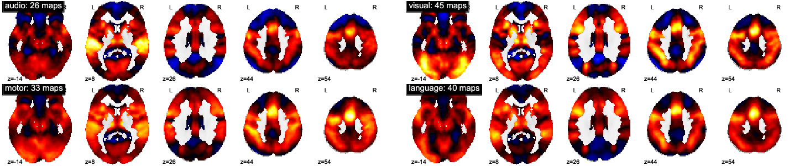
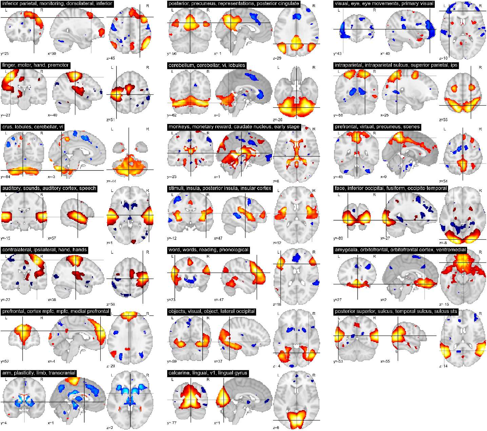

Spatial distribution of activations
------------------------------------

.. figure:: activation_frequency.pdf

    **Figure 1:** Spatial distribution of activations in NeuroVault

Figure 1 shows the spatial distribution of activation for the maps in
NeuroVault: the of how many times a voxel appeared in a statistical map
with a Z or a T greater than 3. The distribution is strickingly
non-uniform throughout gray matter. In particular, the regions most
represented are the frontal part of the insula and dorsal ACC, that form
a well-known cingula-insulate control network associated with salience
processing [Seeley 2007, Dissociable Intrinsic Connectivity Networks for
Salience Processing and Executive Control]. The other structures
highlighted in figure 1 are the IPS, the , --regions sometimes called the
"task positive network" [Fox 2005, The human brain is intrinsically
organized into dynamic, anticorrelated functional networks]-- as well as
the occipital lobe. The presence of the latter can be explained by the
fact that many experiments rely on visual stimuli. Interestingly, the
networks that stand out on this map are largely related to attention and
executive control.

Figure 2 shows a similar map computed from a coordinate-based meta
analysis database, NeuroSynth, that collects coordinates of activation
foci from the literature [Yarkoni ...]

.. figure:: neurosynth_frequency.pdf

    **Figure 2:** Spatial distribution of activations in NeuroSynth

Term-average maps
------------------

From a global perspective, to understand better the spatial distribution
of detections, it is also interesting to look at the average activation
across all the database. On figure 3 we give the overall average of the
statistical maps.

.. figure:: all.pdf
    :scale: 50

    **Figure 3:** Mean map for all the statistical maps in NeuroVault

Unlike a simple count of statistically-significant detections, as in a
coordinnate-based meta-analysis, this analysis also captures the dominant
sign of the activation, accumulating power in regions that may not
cross threshold in individual analyses [#]_. The average maps clearly
shows regions that responds, on average, by a deactivation, rather than
an activation. These span the default-mode network, that was historically
discovered in a similar analysis, noting a decrease in activity across a
variety of tasks [Shulman 1997, Common blood flow changes across
visual tasks: II. Decreases in cerebral cortex].

.. [#] Note that doing a principled statistical inference, eg computing
       an p-value or a posterior from this heterogeneous collection of
       maps require methodological developments outside of the scope of
       this article.

One challenge to run finer analysis on data hosted on neurovault is that,
unlike BrainMap [Fox XXX] or NeuroSynth [Yarkoni XXX], the images do not
come with explicit labels describing their content. We use a simple
heuristic to assign labels to images: for each image, we look at its
meta-data: its name, description, description of the contrast, if
available. We assign a label to an image if this meta-data contains a
term associated with, where the labels and associated terms are given in
table 1.

========== ====================================================================
Label       Associated terms
========== ====================================================================
language    semantic, linguistic, language, word, words, reading, verb, voice
audio       audio, auditory, audition, listening
motor       motor, button, hand
visual      face, imagery, scrambled, checkerboard, color, visual, visually
========== ====================================================================

  **Table 1**: labels and associated terms
 

    **Figure 4:** Mean map for entries of the database containing various
    terms

Figure 4 shows for each label the mean map of all the entries of the
database that contains the corresponding term. We can see that this very
rough meta-analysis does capture some meaningful information. Indeed, the
average activation related to "auditory" terms highlights very well the
auditory cortex. Similarly the "visual" terms light up the occipital
cortex. However, all these average maps contain non-specific regions that
are not directly related to the terms probed. First, they contain
attentional and executive networks, in particular the dorsal ACC and
frontal insula. Their presence may be explained from the fact that such
functions are recruited in every task performed in the scanner. Second,
they contain regions that are only (VWFA, motor washed out).

Independant component analysis
-------------------------------

    **Figure 4:** ICA maps of the database

